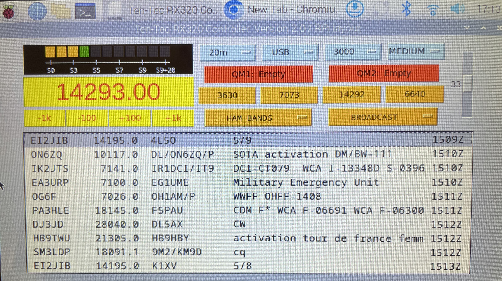

# Ten-Tec RX320 Control Program
## Version 1.0 (July 2026)

---


## 1. Introduction

The **RX320 Control Program** is a Python/Tkinter desktop application for controlling the **Ten-Tec RX320** receiver.

The RX320 is controlled via an RS-232 serial port. It supports only a limited command set, and the desired receive frequency must be converted into the appropriate tuning factors (see the separate document in the `doc` folder of this repository).

The program performs all required calculations to determine the correct tuning values and also applies user-defined `freq_offset` values, allowing accurate frequency after the receiver has been calibrated against an external frequency source.

> **Note:** Due to component aging, the RX320's frequency may drift over time. The `freq_offset` setting can be used to compensate for this drift after calibration.

### Main Features

- **Frequency, Mode, Filter, and AGC** control
- **Direct Frequency** entry with tuning buttons for **±1 kHz** and **±100 Hz**
- **Band** selection with predefined Amateur Radio band frequencies
- **2 Quick Memory** buttons, functioning as temporary memory locations
- **4 Fixed Memory** buttons
- **2 Drop-down** menus with additional frequency/mode presets
- **S-Meter**
- **DX Cluster** window with click-to-tune functionality

> **Note:** The RX320 only supports reading the **signal strength** from the receiver. Frequency, Mode, Filter, and AGC settings cannot be read back, so the application keeps track of their current values internally.

---

## 2. Requirements

- Python 3 with Tkinter (included with most Python installations)
- A serial connection to the receiver (USB/RS-232 cable)
- Internet access for the DX Cluster feature

> **Note:** The Tkinter layout is optimized for a 7" TFT display.

### Required Files

| File | Purpose |
|---|---|
| `rx320.ini` | All user-specific settings |
| `rx320.py` | RX320 communication class |
| `dxcluster.py` | DX Cluster network class |
| `rx320.png` | Ten-Tec logo |

---

## 3. Configuration File: `rx320.ini`

The `.ini` file is divided into several sections. All sections are required.

### `[Radio]`

```ini
port = /dev/ttyUSB0
freq_offset_low = -50
freq_offset_high = -300
cw_pitch = 700
volume = 30
start_frequency = 7073000
```

| Parameter | Description |
|-----------|-------------|
| `port` | Serial port to which the RX320 is connected. Under Linux this is typically `/dev/ttyUSB0`. |
| `freq_offset_low` | Frequency calibration offset (Hz) measured at 100 kHz. |
| `freq_offset_high` | Frequency calibration offset (Hz) measured at 30 MHz. |
| `cw_pitch` | CW audio pitch in Hz. This value is used when tuning to CW signals. |
| `volume` | Initial receiver volume (0–63). |
| `start_frequency` | Frequency in Hz that is set when the program starts. |

---

### `[Memories]`

```ini
fixed = 3630000,LSB;7073000,LSB;14292000,USB;6640000,LSB
extra_1 = 3622000,LSB;3692000,LSB;7060000,LSB;14060000,CW;14345000,USB;28450000,USB;27555000,USB
extra_2 = 648000,AM;819000,AM;6085000,AM;6130000,AM;5450000,USB;5505000,USB;6622000,USB;13264000,USB
```

Each entry is defined as `frequency(Hz),mode`, with entries separated by semicolons (`;`).

- `fixed` — Fills the four fixed memory buttons (in order).
- `extra_1` — Fills the **Extra Memories** drop-down menu, labeled **HAM FREQUENCIES**, for additional amateur radio frequencies that do not require a dedicated button.
- `extra_2` — Fills the **Extra Memories** drop-down menu, labeled **BROADCAST**, for broadcast and utility frequencies.

---

### `[Bandplan]`

```ini
80m = 3500,3600,CW;3600,3800,LSB
40m = 7000,7040,CW;7040,7200,LSB
...
```

Defines the amateur radio band segments, their frequency ranges, and the default operating mode for each sub-range.

The bandplan is used to:

- Populate the **Band** drop-down menu (only bands within the frequency range of the selected receiver model are shown)
- Automatically select the appropriate mode when tuning to a **DX Cluster** spot
- Determine the band name when logging a QSO to **Cloudlog**

All frequencies in the bandplan are specified in **kHz**.

---

### `[DXCluster]`

```ini
host = dxcluster.iu1bow.it
port = 7300
call = NOCALL
```

Defines the preferred **DX Cluster** server and the callsign used for login.

| Parameter | Description |
|-----------|-------------|
| `host` | DX Cluster server hostname or IP address |
| `port` | Telnet port used by the DX Cluster server |
| `call` | Callsign used during the login procedure |

---

### `[Filters]`

```ini
commands =
    clear/spots all
    accept/spots on hf and by_zone 14,15,16
```

A list of DX Cluster filter and setup commands that are sent automatically after a successful login.

Each command must be placed on a separate line.

---

## 4. The Main Window



The window title bar shows the program version and the connected **RX320 receiver**.

### Left Part

| Control | Function |
|---|---|
| **S-Meter** | Displays the received signal strength in calibrated S-units. |
| **Frequency field** | Displays the current VFO frequency in kHz. Enter a value and press **Enter** to tune. |
| **4 up/down buttons** | Adjust the frequency by **±1 kHz** or **±100 Hz** depending on the selected tuning step. |

### Right Part

| Control | Function |
|---|---|
| **Four buttons** | Drop-down menus to control **Band, Mode, Filter, and AGC**. |
| **Two Quick Memory buttons** | The **QM1** and **QM2** buttons act as temporary memory locations. If empty, click to store the current receiver settings. Click again to recall the settings. Right-click to clear the memory. |
| **Four Fixed Memory buttons** | Predefined memory locations. Click a button to tune the receiver to the stored frequency and mode. |
| **Two Extra Memories menus** | Drop-down menus containing additional frequency/mode presets: **HAM FREQUENCIES** and **BROADCAST**. |
| **Audio Slider** | Located on the far right and used to adjust the receiver volume. |

### DX Cluster Window

| Action | Function |
|---|---|
| **Double-click (left mouse button) on a spot** | Tunes the receiver to the spot frequency and automatically selects the appropriate mode from the bandplan. |

---


## 5. Troubleshooting

| Symptom | Likely cause |
|---|---|
| Program won't start / crashes immediately | `rx320.ini` is missing, malformed, or missing a required section. |
| No frequency or mode updates from the receiver | Incorrect serial port in `[Radio]`, or a cable/driver issue. |
| No DX spots appear | Check the `[DXCluster]` host, port, callsign, and your internet connection. |
| Band drop-down is empty or missing bands | Check that `[Bandplan]` entries are within the frequency range supported by the RX320. |

---

## 6. File Summary (Linux/macOS)

```
project-folder/
├── rx320.ini          (your settings — edit this)
├── main.py            (main application)
├── rx320.py           (RX320 communication class)
├── dxcluster.py       (DX Cluster network client)
└── rx320.png          (Ten-Tec logo)
```

